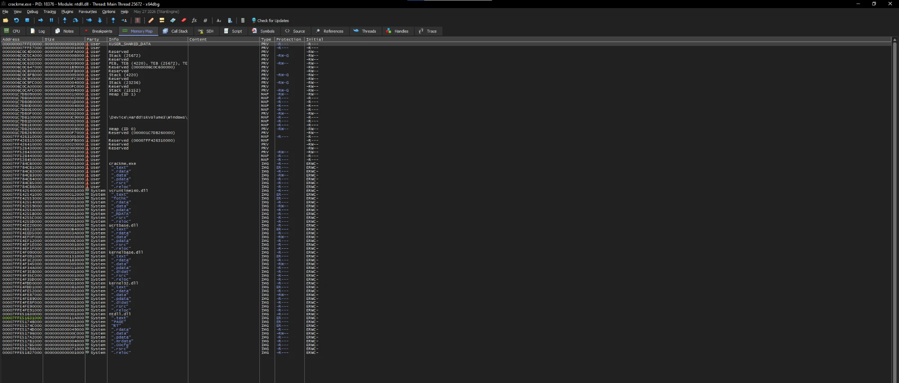
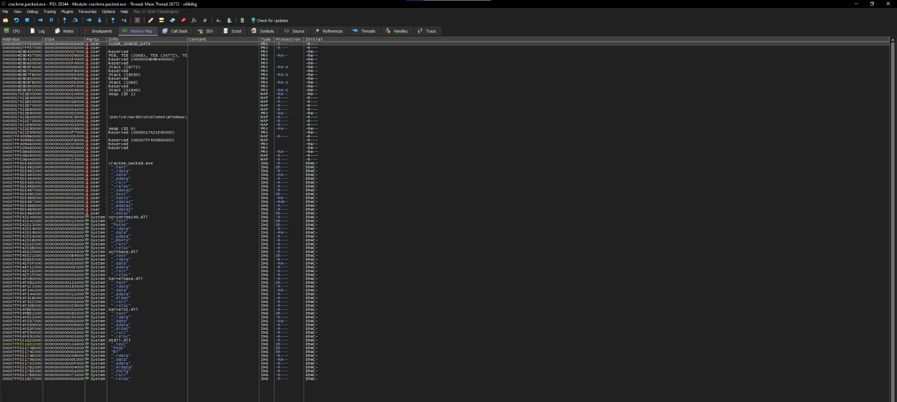

# test-crackme

Tiny demo crackme showcasing a custom PE protector / obfuscator. It asks for a
16-char printable-ASCII serial and checks it with a custom hash + checksum.

| Folder | Contents |
| --- | --- |
| [`non-packed/`](non-packed/) | Original `crackme.exe` + C source in [`src/`](non-packed/src/) |
| [`packed/`](packed/) | Same binary after the protector — `crackme.packed.exe` |

Same program, two builds — `non-packed/` is the reference, `packed/` is the
challenge: find a serial that prints `correct — nice work.`

## Before / after

The same program opened in x64dbg's memory map — the section layout tells the
whole story.

| Original `crackme.exe` | Protected `crackme.packed.exe` |
| --- | --- |
|  |  |
| 6 sections, only `.text` executable | 13 sections; `.text`, `.xdata2` **and** `.data2` executable |

The protector adds 7 sections (`.xdata2`, `.bss1`, `.text1`, `.xdata1`,
`.pdata2`, `.rdata1`, `.data2`). The entry point is relocated into `.data2` — a
24-byte *executable "data"* section — while a ~168 KB `.bss1` blob carries the
payload (mapped `RW`, flipped to executable by the unpack stub at runtime). The
program's own strings (`enter serial`, `correct — nice work`, …) are gone from
`.rdata`; only CRT import names remain.

## Protection

The packed build runs through a custom protector — the kind of passes you'd see
in VMProtect or Themida, implemented from scratch.

**Virtualization**
- Selected functions are lifted to an internal IR and re-emitted as bytecode for
  a custom stack-based VM (down to 3-instruction fragments).
- Two VMs (`VM_A` / `VM_B`) with separate handler tables, so one lifter can't
  cover both.
- Original entrypoints become `JMP` thunks into the VM — callers see the same
  signatures.

**Native code**
- Stolen bytes: chunks of non-virtualized prologues/epilogues are pulled out,
  stored XOR-encrypted, and restored at runtime.
- String literals are XOR-encrypted in the image and decrypted into private
  memory from a TLS callback — nothing for `strings` to grab.

**Imports**
- IAT aliasing: virtualized functions drop their real IAT entries and point at
  neutral imports instead.
- Placeholder imports padded in to muddy import analysis.
- kernel32 calls routed through loader trampolines instead of direct imports
  (static-analysis only — a debugger still sees the real calls).

**PE cleanup**
- `.pdata` zeroed for transformed functions so unwind data doesn't leak their
  boundaries.
- RTTI names and `/guard:cf` tables stripped for transformed regions.
- Base relocations rewritten so the binary stays ASLR-compatible.
- Decoy entry stub: `AddressOfEntryPoint` points at a small shim that hands off
  to the real entry.

No anti-debug, anti-VM, injection, or network/filesystem behavior — purely
static hardening. DEP / ASLR / CFG stay enforced.
